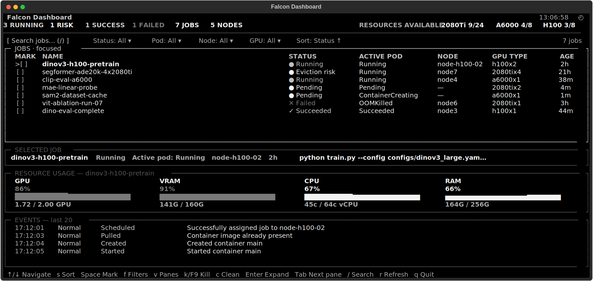
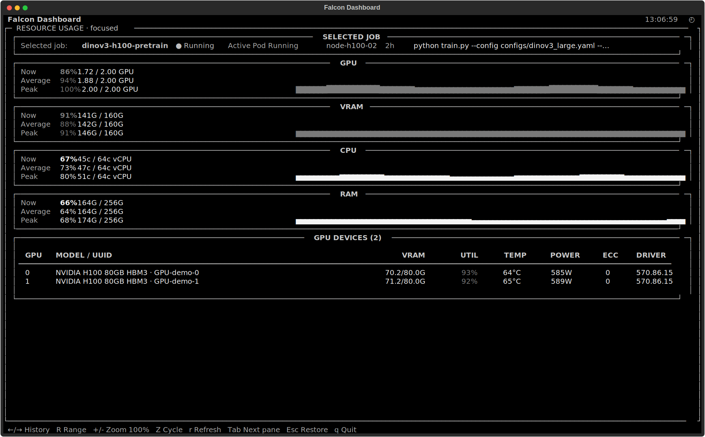

# Falcon

Cluster-aware Kubernetes jobs for GPU research, without writing YAML.

Falcon turns requests such as `h100`, `a6000x2`, or `2080tix3` into schedulable Kubernetes Jobs, sizes CPU and memory from live node capacity, carries the active Python environment into the pod, and provides an nvitop-inspired dashboard for monitoring the result.

[](https://www.python.org/)
[](https://kubernetes.io/docs/concepts/workloads/controllers/job/)
[](LICENSE)

<p align="center">
  
</p>

## Why Falcon?

- **Dynamic GPU presets** — request any valid count: `2080ti`, `2080tix3`, `a6000x2`, `h100x4`.
- **Resource-aware sizing** — select the strongest suitable node profile and derive proportional CPU and RAM without pinning Kubernetes placement.
- **Safe overrides** — override CPU, RAM, shared memory, or request 95% of proportional node capacity with `--max`.
- **Environment continuity** — mount the active Conda/virtual environment and keep its `bin` directory first in the pod.
- **Interactive debug pods** — omit the command to enter a disposable shell with a visible prompt marker such as `(2080tix1)`.
- **Job operations** — native `logs`, `attach`, `top`, `delete`, same-name Job restart, and succeeded-job cleanup.
- **Fast completion** — commands, presets, GPU counts, options, and live Job names complete in Zsh and Bash.
- **Agent-friendly monitoring** — bounded text and JSON snapshots avoid flooding an agent context with TUI frames.
- **Jet underneath** — Falcon builds on Jet, and the original `jet` CLI remains available.

## Quick start

### Requirements

- Python 3.8.1 or newer.
- `kubectl` configured for the target cluster.
- NVIDIA GPU resource labels compatible with the cluster’s Jet configuration.
- Shared storage for mounted home, team directories, and Python environments when Jobs can move between nodes.

### Install from this fork

```bash
git clone https://github.com/DivyamChandalia/falcon.git
cd falcon
python -m pip install -e .
falcon setup
```

`falcon setup` writes `~/.falconrc`, installs an environment-independent launcher under `~/.local/bin`, and adds the appropriate shell initialization to Zsh or Bash. Open a new shell after setup, or source the shell rc file it reports.

If migrating an older preview configuration:

```bash
falcon setup --force
```

## Launch Jobs

Run a command on one H100:

```bash
falcon h100 -- python train.py --config configs/pretrain.yaml
```

Request any GPU count supported by the cluster:

```bash
falcon 2080tix3 -- python train.py
falcon a6000x2 -- python evaluate.py
falcon h100x4 -- torchrun --nproc-per-node=4 train.py
```

Override resources when the automatic plan is not appropriate:

```bash
falcon 2080tix2 \
  -c 48:48 \
  -m 128Gi:128Gi \
  --shm-percent 20 \
  -- python train.py
```

Use proportional node capacity rather than currently free CPU and RAM:

```bash
falcon 2080tix4 --max -- python train.py
```

Falcon warns when an override cannot run immediately, but leaves the Job for Kubernetes to schedule when capacity becomes available.

### Interactive debug pods

Leave out the command to open a disposable debug shell:

```bash
falcon 2080ti
```

The prompt is clearly marked inside the pod while preserving the existing theme, current directory, and Git information:

```text
(2080tix1) ➜ falcon
```

Exiting the shell terminates the session and removes the debug Job. The marker is injected only into debug pods; local shells and command Jobs are unchanged.

### Legacy-compatible submission

Existing scripts using Jet-style Falcon flags continue to work:

```bash
falcon -j experiment-name -n 3 -g 2080ti -a -- python train.py
```

## Resource planning

For a GPU request, Falcon inspects current node metrics and chooses a sizing profile with enough GPUs and the most useful remaining compute. If a node has four GPUs and the request asks for two, the default plan requests roughly half of that node’s CPU and RAM, capped to what is currently schedulable.

Falcon does **not** pin the Job to the sizing node by default. Kubernetes remains free to place it on any compatible node. Use `--pin-node` only when explicit placement is required.

`--max` changes CPU and RAM sizing to approximately 95% of the request’s proportional share of total node capacity, independent of current free capacity. Explicit `-c` and `-m` values still take precedence.

Shared memory defaults to 15% of allocated RAM and can be changed globally, per preset, or per launch.

## Dashboard

```bash
falcon dashboard
```

The full-screen dashboard combines nvitop-style resource visibility with htop-style Job controls:

- Live Kubernetes Job and active-pod state.
- Cluster-wide free/total counts for 2080Ti, A6000, and H100 GPUs.
- GPU utilization, rolling average, VRAM, CPU, and RAM history.
- Per-device GPU memory, utilization, temperature, power, ECC, and driver data.
- Job events, search, filters, marking, sorting, cleanup, and guarded deletion.
- Persistent pane visibility and sorting preferences stored in `.falconrc`.
- Responsive layouts down to `80×22`.

<p align="center">
  
</p>

### Essential controls

| Key | Action |
| --- | --- |
| `Tab` / `Shift+Tab` | Move between visible panes |
| `Enter` or `z` | Expand the focused pane |
| `Esc` | Restore the dashboard or cancel |
| `↑` / `↓` | Navigate the focused pane |
| `Space` | Mark the current Job |
| `f` | Open Job filters |
| `s` | Cycle persistent sort fields |
| `v` | Show or hide optional panes persistently |
| `/` | Search Jobs or Events |
| `k` or `F9` | Open the guarded deletion dialog |
| `c` | Clean succeeded Jobs |
| `r` | Refresh now |
| `q` | Quit |

Status sorting always follows the operational order **Running → Pending/Queued → Failed → Succeeded**. Job rows stay white for readability; only the Status cell carries the state color.

Expanded resource history supports `←`/`→`, `Home`/`End`, `R` for range, and `+`/`-` or `Z` for zoom.

### Eviction-risk signal

Falcon does not flag a Job because of a single low-utilization frame. Risk is evaluated only after a complete 60-sample rolling average:

- H100: below the configured 90% floor by default.
- A6000 and 2080Ti: below the configured 30% floor by default.

The dashboard continues to show instantaneous utilization separately from the eviction-risk average.

### Agent and script snapshots

When stdout is not a terminal, the dashboard automatically emits a bounded, ANSI-free snapshot instead of repeated frames:

```bash
falcon dashboard --once
falcon dashboard --json
falcon dashboard --job experiment-name --json
falcon dashboard --job experiment-name --samples 15 --interval 1 --json
```

## Manage Jobs

```bash
falcon logs experiment-name
falcon attach experiment-name
falcon top experiment-name
falcon delete experiment-name
falcon clean
```

When a Job name is omitted, Falcon uses the most recently launched or selected Job where supported. `falcon clean` removes succeeded Jobs only; running and failed Jobs remain available for inspection.

## Configuration

Setup creates a user-owned `~/.falconrc`. A representative configuration is:

```yaml
version: 1

resources:
  shared_memory_percent: 15

presets:
  h100:
    gpu_type: h100
    minimum_utilization: 90
  a6000:
    gpu_type: a6000
    minimum_utilization: 30
  2080ti:
    gpu_type: 2080ti
    minimum_utilization: 30

dashboard:
  ema_alpha: 0.1
  sort_field: Status
  sort_direction: asc
  hidden_panes: []

cluster:
  namespace: your-namespace

runtime:
  volumes:
    - /media/beegfs/users/your-user/
    - /media/beegfs/teams/
  environment:
    EXPERIMENT_ROOT: /media/beegfs/teams/experiments
```

Namespace, mounts, and environment variables are read from this file after setup rather than being regenerated from `LOGNAME`. Infrastructure-specific image, scheduler, labels, and pull-secret defaults remain internal to the deployment.

Use a different configuration without modifying the default:

```bash
falcon --config /path/to/falconrc dashboard
FALCON_CONFIG=/path/to/falconrc falcon h100 -- python train.py
```

See [docs/falcon.md](docs/falcon.md) for the complete behavior and key reference.

## Jet compatibility

Falcon is implemented alongside the original Jet toolkit. Existing Jet workflows remain available, including raw Job launches, Jupyter sessions, services, templates, and the Jet TUI.

- [Submitting Jet Jobs](docs/submitting-jobs.md)
- [Debug Sessions](docs/debug-sessions.md)
- [Jupyter Sessions](docs/jupyter-notebooks.md)
- [Services](docs/services.md)
- [Templates](docs/templates.md)
- [Monitoring](docs/monitoring-jobs.md)
- [Other Jet Commands](docs/other-commands.md)

## Development

Install the project in an environment with its development dependencies, then run:

```bash
python -m pytest -q
```

The suite covers resource planning, shell integration, configuration persistence, bounded agent output, Kubernetes collection, and responsive dashboard interaction.

## Attribution and license

Falcon is built on [Jet: A CLI Job Execution Toolkit for Kubernetes](https://github.com/manideep2510/jet-k8s) by Manideep Kolla and contributors.

Licensed under the [Apache License 2.0](LICENSE).
