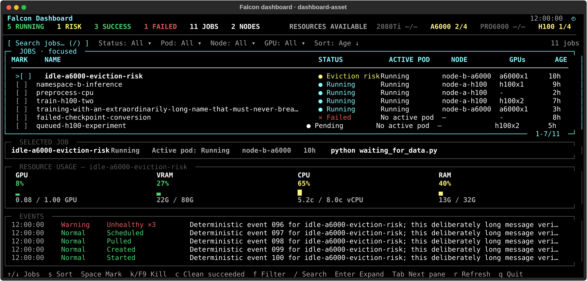
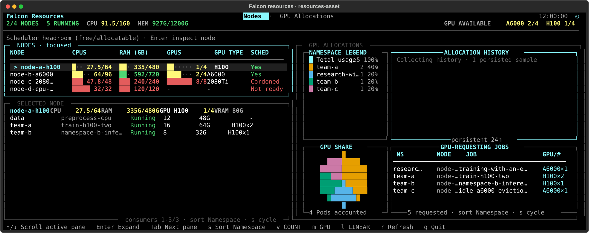

# Falcon

Launch and monitor GPU workloads on Kubernetes without writing Job YAML.

Falcon selects GPU nodes, sizes CPU and memory from live capacity, carries your
working directory and Python environment into the container, and gives you
terminal dashboards for jobs and cluster resources.

```console
falcon h100x2 -j experiment -- python train.py
```

## Quick start

Falcon requires Python 3.10+, `kubectl`, a working Kubernetes context, and
permission to inspect cluster resources and create Jobs.

Install directly from GitHub and run the guided setup—no clone is required:

```console
pip install --user git+https://github.com/DivyamChandalia/falcon.git@main
falcon setup
```

Open a new shell after setup, then launch and manage a named workload:

```console
falcon h100 -j quickstart -- python train.py
falcon dashboard
falcon logs quickstart
falcon kill quickstart
```

**Jobs dashboard**



> [!NOTE]
> Falcon's default configuration targets NVIDIA GPU nodes labelled with
> `gpu-type` and the KAI scheduler. `falcon setup` lets you change the namespace,
> image, mounts, GPU presets, and scheduler for your cluster.

## Why Falcon

Without Falcon, starting one experiment can mean choosing an image, sizing
resources, adding node selectors, mounting storage and shared memory, carrying
environment settings, and defining cleanup behavior.

With Falcon, the request is one line:

```console
falcon h100x2 -- python train.py
```

Falcon discovers capacity, creates the Job directly, mounts an active
Conda/virtual environment by default when one is detected, and retains GPU
allocation history for completed workloads.

The equivalent legacy `jet` command requires those choices up front:

```console
jet launch job train \
  --image YOUR_RUNTIME_IMAGE \
  --command "python train.py" \
  --gpu 2 \
  --gpu-type h100 \
  --cpu REQUEST:LIMIT \
  --memory REQUEST:LIMIT \
  --shm-size SIZE \
  --pyenv "$CONDA_PREFIX" \
  --volume "$PWD:$PWD" \
  --working-dir "$PWD"
```

Falcon derives CPU, memory, and shared-memory values from live capacity. The
manual example below uses illustrative static values; they are not Falcon
defaults.

<details>
<summary>Show a representative Kubernetes Job YAML</summary>

```yaml
apiVersion: batch/v1
kind: Job
metadata:
  name: train
  namespace: research
spec:
  template:
    spec:
      schedulerName: kai-scheduler
      restartPolicy: Never
      nodeSelector:
        gpu-type: h100
      containers:
        - name: train
          image: your-runtime-image
          command: ["/bin/bash", "-lc", "python train.py"]
          workingDir: /workspace
          env:
            - name: PATH
              value: /opt/python-env/bin:/usr/local/bin:/usr/bin:/bin
          resources:
            requests:
              cpu: "24"
              memory: 192Gi
              nvidia.com/gpu: "2"
            limits:
              cpu: "24"
              memory: 192Gi
              nvidia.com/gpu: "2"
          volumeMounts:
            - name: workspace
              mountPath: /workspace
            - name: python-env
              mountPath: /opt/python-env
            - name: shared-memory
              mountPath: /dev/shm
      volumes:
        - name: workspace
          hostPath:
            path: /path/to/project
        - name: python-env
          hostPath:
            path: /path/to/python-environment
        - name: shared-memory
          emptyDir:
            medium: Memory
            sizeLimit: 29Gi
```

The image, namespace, scheduler, resource sizes, and host paths must match your
cluster.

</details>

## Run workloads

The default configuration includes these GPU presets and limits:

| Preset | Maximum GPUs |
| --- | ---: |
| `h100` | 8 |
| `2080ti` | 4 |
| `a6000` | 2 |
| `pro6000` | 2 |

Append `xN` to request multiple GPUs, such as `2080tix4` or `pro6000x2`.

Useful launch options:

```console
# Follow logs after submitting
falcon h100 -f -- python train.py

# Preview the Kubernetes manifest without creating a Job
falcon pro6000x2 --dry-run --output json -- python train.py

# Override automatic CPU and memory sizing
falcon a6000 -c 12 -m 64Gi -- python train.py

# Run without a GPU
falcon -c 8 -m 32Gi -- python preprocess.py

# Open a temporary interactive shell
falcon 2080ti
```

Bare memory numbers are interpreted as GiB: `-m 5` is equivalent to
`-m 5Gi`. Explicit Kubernetes units remain supported, and the rule applies to
both sides of a request/limit pair (`-m 5:8` means `5Gi:8Gi`).

The interactive shell opens in your current working directory and is removed
when you exit.

## Monitor jobs

Open the interactive Jobs dashboard:

```console
falcon dashboard
```

Or use individual commands:

| Command | Purpose |
| --- | --- |
| `falcon jobs` | List jobs |
| `falcon get JOB` | Inspect a job and its attempts |
| `falcon logs JOB` | Follow logs |
| `falcon events JOB` | Show Kubernetes events |
| `falcon metrics JOB` | Return available CPU, RAM, GPU, and VRAM metrics |
| `falcon kill JOB` | Remove a job |

## Inspect cluster resources

```console
falcon resources
```

**Nodes: free CPU, memory, and GPUs by node**



The **Nodes** view shows free resources for every node. Select a node and press
<kbd>Enter</kbd> to inspect the jobs using it.

Use <kbd>←</kbd>/<kbd>→</kbd> to switch views, <kbd>Tab</kbd> to move focus,
and <kbd>Enter</kbd> to expand the selected pane. Falcon remembers your last
view and keeps GPU allocation history in the background.

**GPU Allocations: history, namespaces, and active GPU jobs**


In **GPU Allocations**, press <kbd>v</kbd> to switch namespace shares between
GPU count and requested VRAM.

Resource values are based on Kubernetes requests and allocations. Falcon does
not present them as measured GPU compute utilization.

## Optional: Create a Coder workspace

Coder integration requires access to a Coder deployment and a compatible
workspace template.

Create a workspace with CPU and memory:

```console
falcon coder -c 4:4 -m 8Gi:8Gi
```

Or size it from a GPU preset and choose a name:

```console
falcon coder pro6000 -j research
```

Falcon waits for the workspace and prints available links for VS Code,
Antigravity, Cursor, JupyterLab, and the web terminal. Editor links open the
directory where you ran the command.

Print links for an existing workspace:

```console
falcon coder research
```

On your first run, Falcon shows a Coder sign-in link and saves the pasted
session token in Coder's standard session file. Delete a workspace through
Coder by killing its full Kubernetes Job name (completion can supply it):

```console
falcon kill coder-alice-research
```

## Shell completion

Falcon completes presets, valid GPU counts, options, jobs, and Coder workspace
names. To load completion immediately after setup:

```console
eval "$(falcon completion zsh)"  # use bash for Bash
```

Examples:

```text
falcon h100<TAB>          h100x2 … h100x8
falcon pro6000<TAB>       pro6000x2
falcon logs <TAB>         current jobs
falcon coder <TAB>        current Coder workspaces
```

## Configuration

Falcon reads `~/.falconrc`. Common settings include the Kubernetes namespace,
runtime image, GPU label, resource history, presets, and Coder template.

```yaml
cluster:
  namespace: research
  gpu_label: gpu-type
presets:
  pro6000:
    gpu_type: pro6000
    max_count: 2
```

See [Configuration](docs/configuration.md) for all available settings.

## Update or remove Falcon

Update to the latest version from GitHub:

```console
pip install --user --upgrade git+https://github.com/DivyamChandalia/falcon.git@main
```

Remove the package:

```console
pip uninstall falcon-k8s
```

## Troubleshooting

- **`falcon: command not found`** — open a new shell after setup, or add the
  user scripts directory to your current shell with
  `export PATH="$HOME/.local/bin:$PATH"`.
- **Kubernetes access errors** — check `kubectl config current-context` and
  verify that you can create Jobs in the namespace selected during setup.
- **No matching GPU nodes** — check `presets` and `cluster.gpu_label` in
  `~/.falconrc`, then compare them with your cluster's node labels.
- **Coder authentication expired** — run `falcon coder WORKSPACE` again;
  Falcon will reopen the sign-in flow and save the new session token.

Run `falcon config` to print the active configuration path.

## Documentation

- [CLI reference](docs/cli.md)
- [Configuration](docs/configuration.md)
- [TUI controls](docs/tui.md)
- [Resource semantics](docs/resource-semantics.md)
- [JSON schema](docs/json-schema.md)
- [Coder and agent workflows](docs/agents.md)
- [Development](docs/development.md)

Common short aliases are also available: `j` jobs, `g` get, `e` events, `l`
logs, `a` attach, `t` top, `m` metrics, `k` kill, `c` clean, `d` dashboard,
`r` resources, and `s` setup.

## TODO

- Fix the intermittent issue where `falcon resources` breaks.
- Port the Falcon agent interface to an MCP server for long-running goal loops.

Falcon is licensed under Apache-2.0. See [NOTICE](NOTICE) for attribution.
