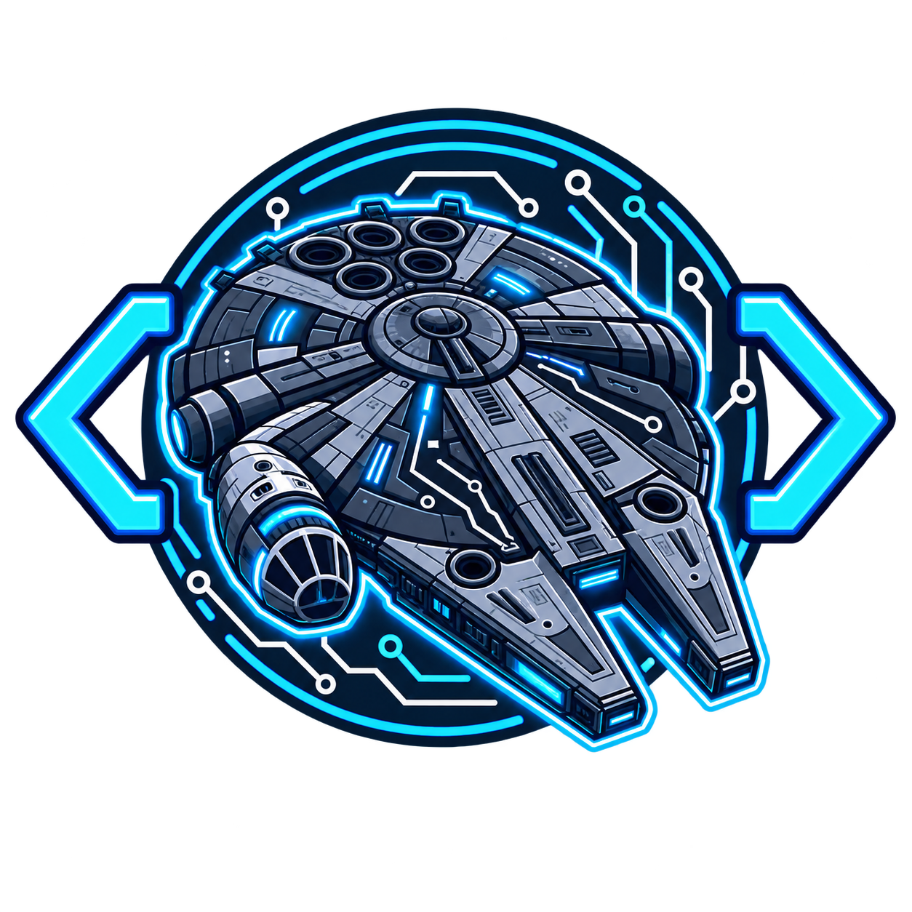
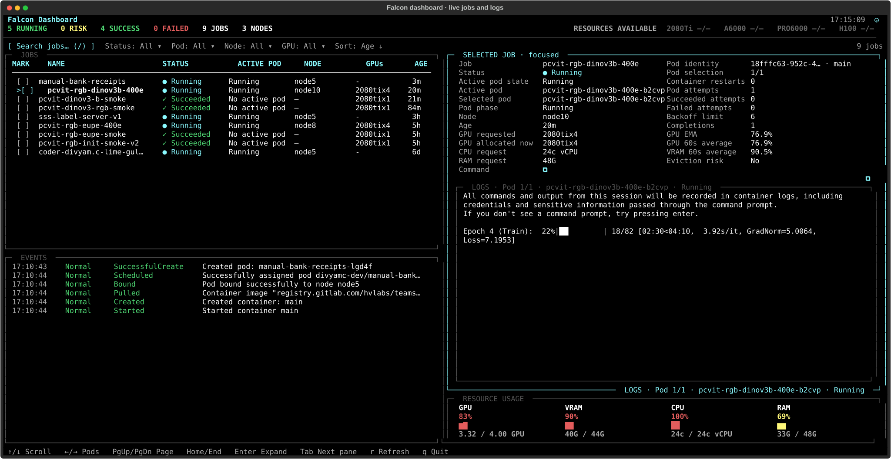
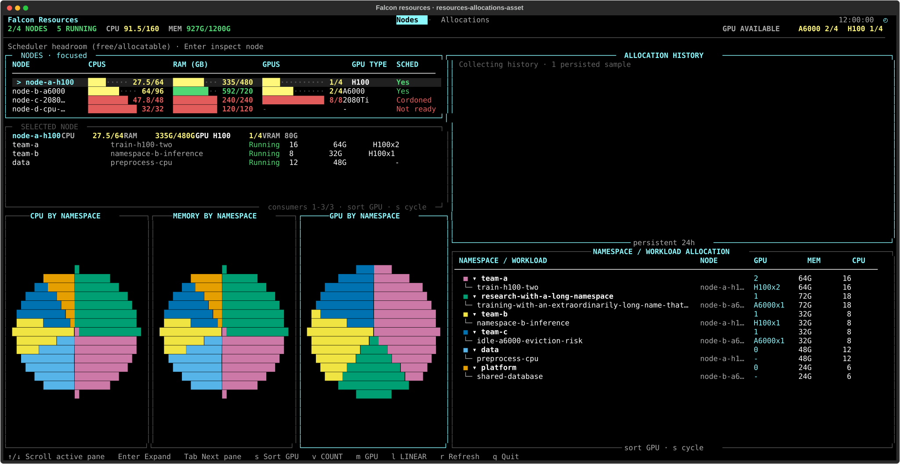

<h1>
  Falcon
  
</h1>

Launch and monitor GPU workloads on Kubernetes without writing Job YAML.

Falcon chooses eligible GPU nodes, sizes CPU and memory from live capacity,
carries your working directory and Python environment into the container, and
provides interactive dashboards for jobs and cluster resources.

New in 0.4.6: interactive Dashboard terminals (`Ctrl+T`), Resources workload
filters (`f`), and updates that support uv tool installations.
See the [changelog](CHANGELOG.md) for details.

## Quick start

You need Python 3.10+, `kubectl`, a working Kubernetes context, and permission
to inspect cluster resources and create Jobs.

Install Falcon with pip and run the guided setup:

```console
pip install --user git+https://github.com/DivyamChandalia/falcon.git@main
falcon setup
```

Or, if you use [uv](https://docs.astral.sh/uv/), install Falcon as an isolated
tool so it does not depend on your project's Python environment:

```console
uv tool install git+https://github.com/DivyamChandalia/falcon.git@main
falcon setup
```

If uv's tool executables are not on `PATH`, run `uv tool update-shell`, then
open a new terminal. Update with `falcon update` or
`uv tool upgrade falcon-k8s`.

Start a named GPU workload, then monitor or stop it:

```console
falcon h100x2 -j experiment -- python train.py
falcon dashboard
falcon logs experiment
falcon kill experiment
```

Run `falcon setup` again to review or change the namespace, image, mounts, GPU
presets, and scheduler. Setup also checks `kubectl`; if it is outside your home
directory, it asks whether to copy it to `$HOME/.local/bin/kubectl`. This lets
Coder sessions use `kubectl` and Falcon to schedule Jobs, provided the session
has a valid kubeconfig and the required Kubernetes permissions. The default
answer is **Yes**; `--non-interactive` accepts the copy automatically.

If the command is not found after installation, open a new shell or run:

```console
export PATH="$HOME/.local/bin:$PATH"
```

## Run workloads

Request a GPU preset with an optional count:

```console
falcon h100 -- python train.py
falcon pro6000x2 -j research -- python train.py
```

Falcon also supports CPU-only workloads and interactive shells:

```console
falcon -c 8 -m 32Gi -- python preprocess.py
falcon 2080ti
```

Useful launch options:

| Option | Use it to |
| --- | --- |
| `-j NAME` | give the Job a stable name |
| `-f` | follow logs after submitting |
| `-c VALUE` | override CPU requests/limits |
| `-m VALUE` | override memory requests/limits |
| `--dry-run --output json` | inspect the generated manifest without creating a Job |
| `--image IMAGE` | choose the runtime image |

Bare memory values are interpreted as GiB: `-m 5` means `5Gi`. Request/limit
pairs are supported, for example `-m 5:8`.

The default GPU presets are configurable with `falcon setup`:

| Preset | Maximum GPUs |
| --- | ---: |
| `h100` | 8 |
| `2080ti` | 4 |
| `a6000` | 2 |
| `pro6000` | 2 |

See [CLI reference](docs/cli.md) for all launch options and scheduling
behavior.

## Monitor jobs

Open the interactive dashboard:

```console
falcon dashboard
```

The Selected Job pane includes live Logs for the selected workload. It follows
new output, supports scrolling through retained lines, and keeps carriage-return
progress updates such as `tqdm` on the current line. Use `falcon logs JOB` when
you want a terminal-only log stream.

With Selected Job focused, `Ctrl+T` opens an interactive shell in its running
Pod, inside the Logs area. Press it again for another terminal; `←`/`→` switches
between logs and terminals. `Ctrl+D` (or `Ctrl+W`) closes the current terminal.
`Ctrl+C` copies selected text; without a selection it interrupts the shell
command, not the Job. Use `Alt+←`/`Alt+→` to move the shell cursor.
The terminal owns typing and Tab completion while focused, shows a cursor, and
retains up to 200 lines for mouse-wheel scrolling. It uses the same shell startup
as debug Jobs, loading your rc file when accessible inside the Pod, with a short
directory-name prompt. Click outside the terminal to restore Dashboard keyboard
controls. The Copy button copies the active terminal's retained output.



For focused inspection, use:

| Command | What it shows |
| --- | --- |
| `falcon jobs` | current Jobs |
| `falcon get JOB` | Job details and attempts |
| `falcon logs JOB` | Job logs |
| `falcon events JOB` | Kubernetes events |
| `falcon metrics JOB` | CPU, RAM, GPU, and VRAM metrics |
| `falcon kill JOB` | remove a Job |

## Inspect cluster resources

```console
falcon resources
```



Resources has two sides on terminals at least `160×30`: **Nodes** on the left
and **Allocations** on the right. Smaller terminals keep the two views as
separate pages. In the large layout, click or Tab between individual panes;
only one is focused at a time. The Nodes/Allocations header selector appears
only on compact pages, not in combined or individually expanded views.

Allocations combines Allocation History, namespace pies, and a hierarchical
Namespace / Workload Allocation table. The table contains requested GPU,
memory, and CPU totals for each namespace and its workloads. These are
Kubernetes scheduler requests, not measured utilization. The chart keeps an
aspect-correct footprint and the history/allocation areas share the available
height.

| Key | Action |
| --- | --- |
| `↑` / `↓` | move through the active node, workload, or allocation rows |
| `←` / `→` | switch Nodes and Allocations below `160×30` |
| `Tab` / `Shift+Tab` | move between visible panes |
| `s` | cycle shared sorting: GPU, memory, CPU, namespace |
| `f` | filter workloads by minimum GPUs, CPU, memory, or namespace |
| `m` | cycle allocation charts: GPU, memory, CPU |
| `v` | switch GPU count and VRAM while GPU mode is active |
| `l` | switch Allocation History between linear and log scale |
| `Enter` / `Esc` | expand a pane / restore the layout |

The `m`, `v`, and `l` controls also work while Selected Node is expanded, so
the allocation view is ready when you return to it. See [TUI controls](docs/tui.md)
for responsive layouts, sorting, history, and chart details.

## Optional: Coder workspaces

Coder integration requires access to a Coder deployment and a compatible
workspace template. Create a workspace with CPU and memory:

```console
falcon coder -c 4:4 -m 8Gi:8Gi
```

Or use a GPU preset and name it:

```console
falcon coder pro6000 -j research
falcon coder research
```

Falcon waits for the workspace and prints links for VS Code, Antigravity,
Cursor, JupyterLab, and the web terminal. See [Coder and agent workflows](docs/agents.md)
for authentication and workspace requirements.

## Configuration

Falcon stores configuration in `~/.falconrc`. The guided setup is the easiest
way to create or edit it:

```console
falcon setup
falcon config
```

Common settings include the Kubernetes namespace, runtime image, GPU label,
resource history, presets, and Coder template. For the full list, see
[Configuration](docs/configuration.md).

## Shell completion

Enable completion for the current shell:

```console
eval "$(falcon completion zsh)"  # use bash for Bash
```

Completion includes GPU presets, valid counts, Jobs, and Coder workspaces.

## Update or remove Falcon

```console
falcon update
falcon update --check
pip uninstall falcon-k8s
```

For `uv tool` installations, `falcon update` uses `uv tool upgrade` and
preserves your installed source, version constraints, and extra dependencies.
Other installations use pip in Falcon's Python environment. uv must be on
`PATH` to update a uv-managed installation; Falcon never falls back to pip
inside a uv tool environment. To remove a uv installation, use
`uv tool uninstall falcon-k8s` instead of pip.

After a successful update, Falcon prints a short “What’s new” summary from
the latest changelog entries. If the notes cannot be fetched, the update still
completes normally.

The updater checks for releases silently on non-interactive commands. Set
`FALCON_NO_UPDATE_CHECK=1` to disable the interactive update prompt.

## Troubleshooting

- **`falcon: command not found`** — open a new shell or add
  `$HOME/.local/bin` to `PATH`.
- **Kubernetes access errors** — check
  `kubectl config current-context` and verify that the context can create Jobs
  in the configured namespace.
- **No matching GPU nodes** — compare the configured GPU label and preset with
  your cluster's node labels and available capacity.
- **Coder authentication expired** — run `falcon coder WORKSPACE` again to
  reopen the sign-in flow.

## More documentation

- [CLI reference](docs/cli.md)
- [TUI controls](docs/tui.md)
- [Configuration](docs/configuration.md)
- [Resource semantics](docs/resource-semantics.md)
- [Coder and agent workflows](docs/agents.md)
- [JSON schema](docs/json-schema.md)
- [Development](docs/development.md)
- [Changelog](CHANGELOG.md)

## TODO

- [ ] Port the Falcon agent interface to an MCP server for long-running goal loops.
- [ ] Show workload age in the Allocations view.
- [ ] Add a Falcon command for launching bounded agent goal loops as Kubernetes
  Jobs, with explicit read-only data mounts, a working directory, a selectable
  Codex/Claude Code/OpenCode CLI, and a user prompt.
- [ ] Add local-model support through shared vLLM instances so multiple users and
  agent Jobs can discover and consume hosted models.
- [ ] Make resource requests aware of Kubernetes Pod eviction policy.
- [ ] Make it possible to launch workloads as long-running Kubernetes Services.

Falcon is licensed under Apache-2.0. See [NOTICE](NOTICE) for attribution.
